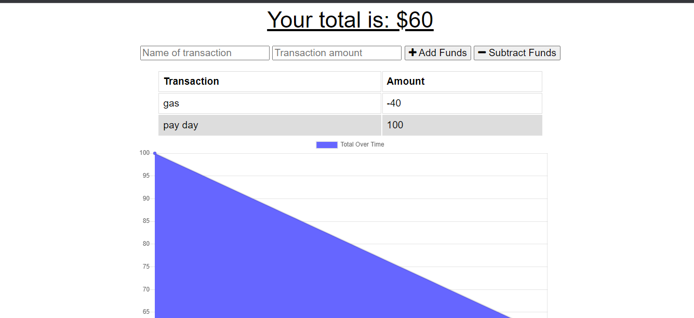

# Budget Tracker

This project is a progressive web application (PWA) used to track expenditures and incoming finances. The purpose of this project is to have a visualization of your budget and automate calculations.


## Authors

- [@noothanks](https://www.github.com/noothanks)


## Installation

- Clone repo into directory of your choice
- Open project
- Install dependencies with npm

```bash
  npm install
  npm start
```
    
## Deployment

This app is currently not deployed. Please see the installation instructions above for download instructions.


## License

[MIT](https://choosealicense.com/licenses/mit/)


## Contributing

This project is currently closed for contribution, but feel free to leave an issue for bugs and improvements.


## Screenshots

